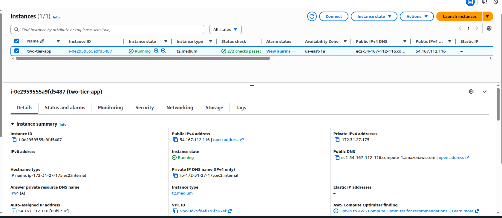
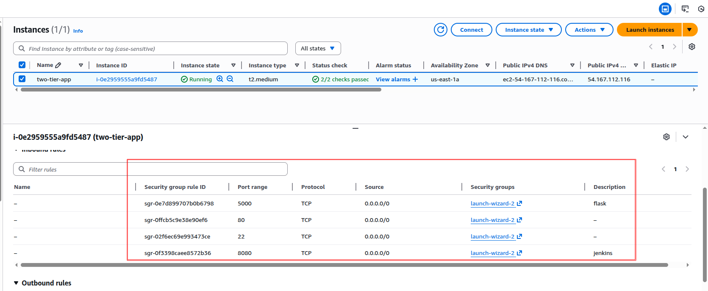
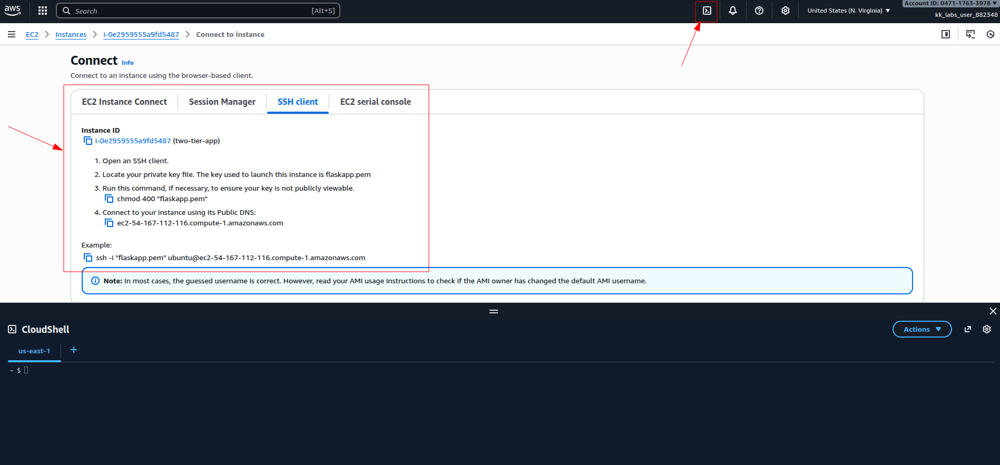
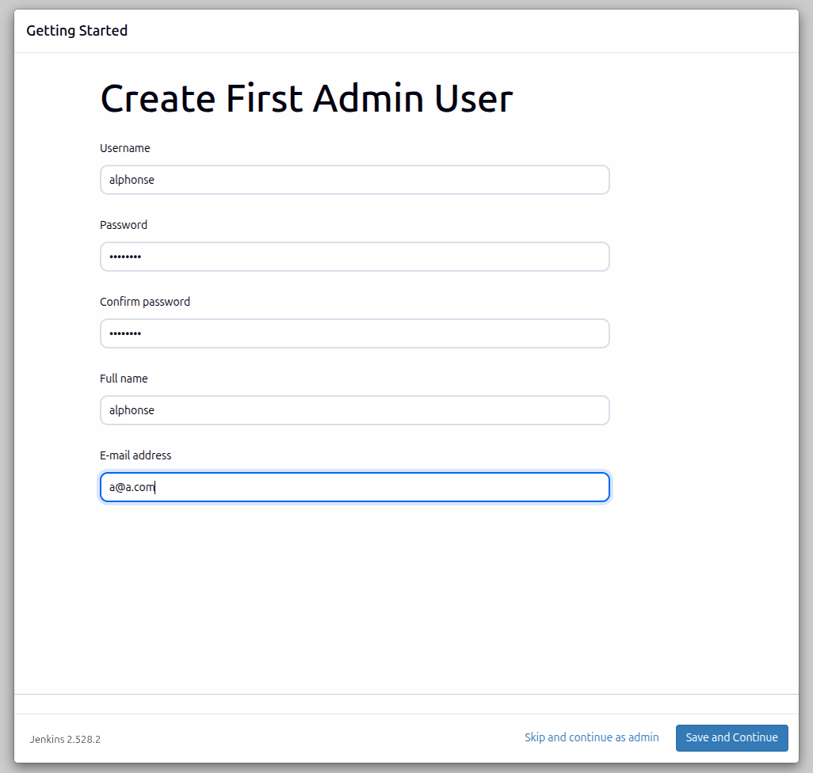
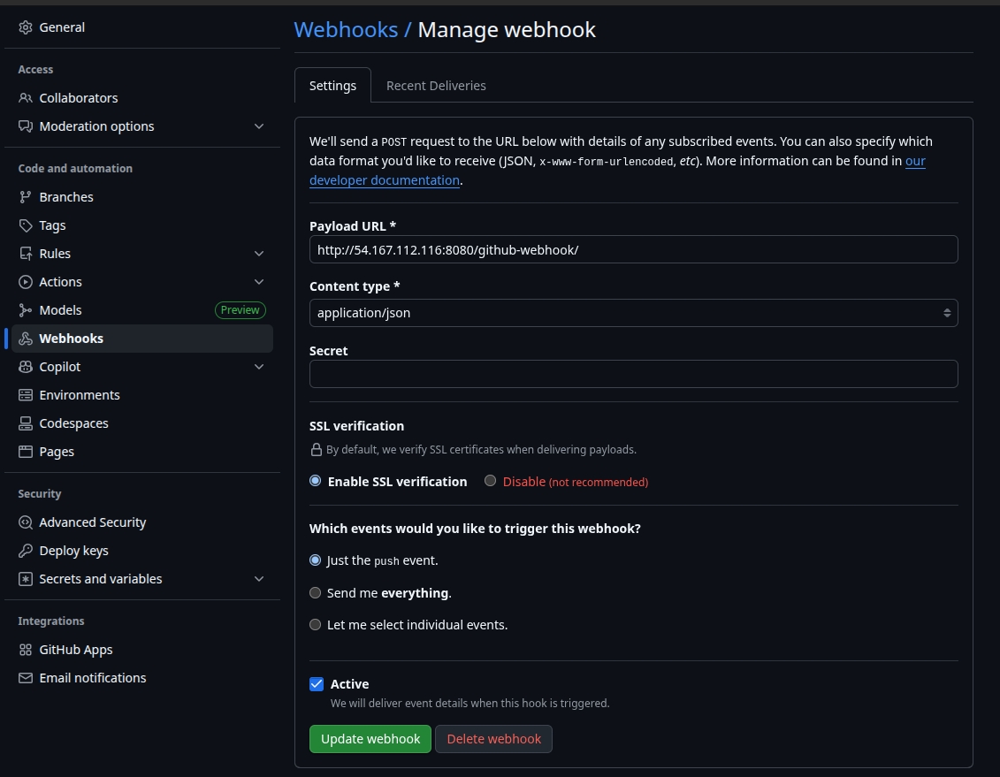
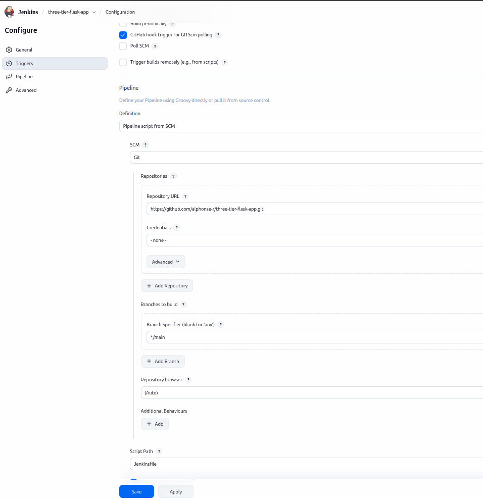
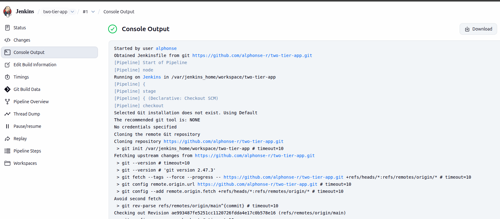
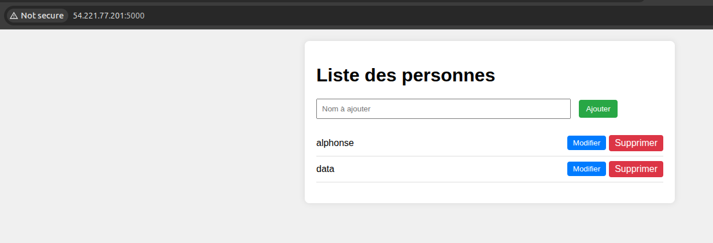

# Description du projet

Ce projet est une application web minimale développée avec Flask comme backend et html, css et js comme frontend. Et connectée à une base de données MariaDB sur une instance EC2 d'AWS.

L’application expose trois routes :

`*/` -> Route principale 

`*/mysql` -> Vérifie la connexion à MariaDB

`*/health` -> Vérifie l'état de santé de l'app (utile pour Docker, docker-compose)

L’objectif est également d’apprendre à containeriser, déployer et orchestrer une application complète en utilisant Docker (Dockerfile) et docker-compose.

Le projet inclut également un pipeline CI/CD avec Jenkins qui est déclenché automatiquement via Webhook GitHub.

# Etape 1: Préparation de l'instance EC2

### Créer l'instance EC2 :
- Naviguer sur AWS EC2 console.
- Créer une nouvelle instance. Dans ce projet j'ai utilisé Ubuntu 24.04 LTS AMI.
- Choisir t2.medium comme type d'instance. Vous pouvez utiliser t3.micro si vous êtes sur l'offre gratuit. 
- Créer une paire de clés pour l'accès SSH.



### Configurer le groupe de sécurité :
Créer un groupe de sécurité avec les règles entrantes (inbound rules) suivant :
- Type: SSH, Protocol: TCP, Port: 22, Source: Votre IP
- Type: HTTP, Protocol: TCP, Port: 80, Source: 0.0.0.0/0
- Type: Custom TCP, Protocol: TCP, Port: 5000 (Flask), Source: 0.0.0.0/0
- Type: Custom TCP, Protocol: TCP, Port: 8080 (Jenkins), Source: 0.0.0.0/0



### Connecter à l'instance EC2 :
Utiliser CloudShell et suivre les étapes sur l'image ci-dessous pour s'y connecter. N'oubliez pas d'ajouter dans cloudshell votre pair de clés.



# Etape 2: Installation des dépendances dans EC2

### Mettre à jour les packets système :
```bash
sudo apt update && sudo apt upgrade -y
```
### Installer Git, Docker et Docker Compose :
```bash
sudo apt install git
curl -fsSL https://get.docker.com -o get-docker.sh
sudo sh get-docker.sh
```
### Ajouter l'utilisateur dans groupe Docker pour executer les commandes docker sans sudo :
```bash
sudo usermod -aG docker $USER
```
### Recharger votre appartenance au groupe docker sans avoir besoin de se déconnecter/reconnecter :

```bash
newgrp docker
```
### Vérifier que vous pouvez éxecuter les commandes docker sans sudo :
```bash
docker --version
docker compose version
```
# Etape 3: Installation et configuration de Jenkins 
Si vous avez utiliser t3.micro comme type d'image EC2 merci d'installer Jenkins directement dans le serveur EC2 sans passer par docker. Pour tout ce qui suit je vais utiliser docker pour installer Jenkins.

### Créer un Dockerfile basé sur l'image Jenkins :
Par défaut Jenkins ne peut pas éxecuter les commandes git, docker et docker compose. Alors nous allons installer ces trois packets à l'intérieur de Jenkins afin qu'il puisse éxecuter notre pipeline.
#### DockerfileJ
```bash
# Jenkins LTS officiel
FROM jenkins/jenkins:lts-slim-jdk21

# Passe en root pour installer des packages
USER root

# Installer Git et Docker CLI + Docker Compose v2
RUN apt-get update && \
    apt install git && \
    curl -fsSL https://get.docker.com -o get-docker.sh && \
    sh get-docker.sh && \
    rm -rf /var/lib/apt/lists/*

# Retour à l’utilisateur jenkins
USER jenkins
```
### Construire l'image Jenkins personnalisée  :

```bash
docker build -t jenkins-with-docker-git -f DockerfileJ .
```
### Créer un conteneur Jenkins avec l'image *jenkins-with-docker-git* :
```bash
docker run -d \
  --name jenkins \
  -p 8080:8080 -p 50000:50000 \
  -v jenkins_home:/var/jenkins_home \
  -v /var/run/docker.sock:/var/run/docker.sock \
  --group-add $(getent group docker | cut -d: -f3) \
  jenkins-with-docker-git
```
- __`-v /var/run/docker.sock:/var/run/docker.sock`__ -> permet à Jenkins d’exécuter Docker sur le serveur hôte, sinon les conteneurs créés n’existeraient qu’à l’intérieur de Jenkins.
- __`--group-add <docker_gid>`__ -> ajoute l’utilisateur jenkins au groupe docker du host
- __`$(getent group docker | cut -d: -f3)`__ -> récupère l’ID du groupe docker sur l’hôte

### Configuration initiale de Jenkins :
- Récupérer le mot de passe admin initiale :
```bash
docker exec jenkins cat /var/jenkins_home/secrets/initialAdminPassword
```
- Accéder à l'interface web de Jenkins sur __`http://<ec2-public-ip>:8080`__
- Coller le mot de passe, installer les plugins et créer un utilisateur admin. 



# Etape 4: Configuration du dépôt GitHub
Voici les fichiers que vous avez besoin dans votre dépot GitHub

#### templates/index.html
```bash
<!DOCTYPE html>
<html lang="fr">
<head>
    <meta charset="UTF-8">
    <title>Gestion des personnes</title>
    <link rel="stylesheet" href="{{ url_for('static', filename='style.css') }}">
</head>
<body>
    <div class="container">
        <h1>Liste des personnes</h1>

        <!-- Formulaire d'ajout -->
        <form method="POST" class="add-form">
            <input type="text" name="name" placeholder="Nom à ajouter" required>
            <input type="hidden" name="action" value="add">
            <button type="submit" class="add-btn">Ajouter</button>
        </form>

        <ul class="person-list">
            
            <li>
                <form method="POST" action="{{ url_for('edit_person', id=person[0]) }}" class="edit-form">
                    <span class="person-name">{{ person[1] }}</span>
                    <input type="text" name="name" value="{{ person[1] }}" class="edit-input">
                    <button type="button" class="edit-btn">Modifier</button>
                    <button type="submit" class="apply-btn">Appliquer</button>
                    <a href="{{ url_for('delete_person', id=person[0]) }}" class="delete-btn">Supprimer</a>
                </form>
            </li>
            
        </ul>
    </div>

    <script src="{{ url_for('static', filename='script.js') }}"></script>
</body>
</html>
```

#### static/style.css
```bash
body {
    font-family: Arial, sans-serif;
    background: #f0f0f0;
    margin: 0;
    padding: 20px;
}

.container {
    max-width: 600px;
    margin: 0 auto;
    background: #fff;
    padding: 20px;
    border-radius: 8px;
    box-shadow: 0 0 10px rgba(0,0,0,0.1);
}

.add-form input[type="text"] {
    width: 70%;
    padding: 8px;
    margin-right: 10px;
}

.add-btn {
    padding: 8px 12px;
    background-color: #28a745;
    color: #fff;
    border: none;
    cursor: pointer;
    border-radius: 4px;
}

.add-btn:hover {
    background-color: #218838;
}

.person-list {
    list-style: none;
    padding: 0;
    margin-top: 20px;
}

.person-list li {
    display: flex;
    align-items: center;
    justify-content: space-between;
    padding: 8px 0;
    border-bottom: 1px solid #ddd;
}

.edit-form {
    display: flex;
    align-items: center;
    width: 100%;
}

.person-name {
    flex: 1;
}

.edit-input {
    display: none;
    flex: 1;
    padding: 6px;
    margin-right: 10px;
}

.edit-btn, .apply-btn, .delete-btn {
    margin-left: 5px;
    padding: 5px 10px;
    border: none;
    border-radius: 4px;
    cursor: pointer;
    text-decoration: none;
    color: #fff;
}

.edit-btn {
    background-color: #007bff;
}

.apply-btn {
    display: none;
    background-color: #007bff;
}

.delete-btn {
    background-color: #dc3545;
}

```

#### static/script.js
```bash
document.querySelectorAll('.edit-form').forEach(form => {
    const editBtn = form.querySelector('.edit-btn');
    const applyBtn = form.querySelector('.apply-btn');
    const input = form.querySelector('.edit-input');
    const nameSpan = form.querySelector('.person-name');

    editBtn.addEventListener('click', () => {
        // Affiche l'input avec la valeur actuelle
        input.style.display = 'inline-block';
        nameSpan.style.display = 'none';

        // Boutons
        editBtn.style.display = 'none';
        applyBtn.style.display = 'inline-block';
    });

    applyBtn.addEventListener('click', () => {
        // Le formulaire POST est envoyé automatiquement
    });
});
```

#### app.py

```bash
from flask import Flask, render_template, request, redirect, url_for
import MySQLdb
import os

# Infos DB depuis les variables d'environnement
DB_HOST = os.environ.get("DB_HOST", "localhost")
DB_USER = os.environ.get("DB_USER", "flaskuser")
DB_PASSWORD = os.environ.get("DB_PASSWORD", "flaskpass")
DB_NAME = os.environ.get("DB_NAME", "devops")

app = Flask(__name__)

def get_db_connection():
    return MySQLdb.connect(
        host=DB_HOST,
        user=DB_USER,
        passwd=DB_PASSWORD,
        db=DB_NAME
    )

def create_table_if_not_exists():
    conn = get_db_connection()
    cur = conn.cursor()
    cur.execute("""
        CREATE TABLE IF NOT EXISTS person (
            id INT AUTO_INCREMENT PRIMARY KEY,
            name VARCHAR(255) NOT NULL
        )
    """)
    conn.commit()
    cur.close()
    conn.close()

# Crée la table si elle n'existe pas au démarrage
create_table_if_not_exists()

@app.route("/", methods=["GET", "POST"])
def index():
    conn = get_db_connection()
    cur = conn.cursor()

    # Ajouter une personne
    if request.method == "POST" and request.form.get("action") == "add":
        name = request.form.get("name")
        if name:
            cur.execute("INSERT INTO person (name) VALUES (%s)", (name,))
            conn.commit()

    # Récupérer toutes les personnes
    cur.execute("SELECT id, name FROM person")
    persons = cur.fetchall()

    cur.close()
    conn.close()

    return render_template("index.html", persons=persons)

@app.route("/delete/<int:id>")
def delete_person(id):
    conn = get_db_connection()
    cur = conn.cursor()
    cur.execute("DELETE FROM person WHERE id = %s", (id,))
    conn.commit()
    cur.close()
    conn.close()
    return redirect(url_for("index"))

@app.route("/edit/<int:id>", methods=["POST"])
def edit_person(id):
    new_name = request.form.get("name")
    if new_name:
        conn = get_db_connection()
        cur = conn.cursor()
        cur.execute("UPDATE person SET name = %s WHERE id = %s", (new_name, id))
        conn.commit()
        cur.close()
        conn.close()
    return redirect(url_for("index"))

@app.route("/health")
def health():
    return "OK", 200

if __name__ == "__main__":
    app.run(host="0.0.0.0", port=5000)
```
#### requirements.txt

```bash
flask==2.2.5
#pymysql==1.0.3
# ou si tu veux mysqlclient (plus "native"), remplace pymysql par mysqlclient
mysqlclient==2.1.1
```

#### Dockerfile

```bash
FROM python:3.9-alpine

WORKDIR /two-tier-app

# Copier les dépendances Python
COPY requirements.txt .

# Installer gcc et dépendances pour MySQL
RUN apk add --no-cache gcc musl-dev mariadb-connector-c-dev \
    && pip install --no-cache-dir -r requirements.txt

# Copier tout le projet (app.py, templates/, static/)
COPY . .

EXPOSE 5000

CMD ["python", "-u", "app.py"]
```

#### docker-compose.yml

```bash
services:
  mysql:
    image: mariadb:lts-ubi9
    container_name: mariadb
    environment:
      MYSQL_DATABASE: "devops"
      MYSQL_USER: "flaskuser"
      MYSQL_PASSWORD: "flaskpass"
      MYSQL_ROOT_PASSWORD: "root"
    ports:
      - "3306:3306"
    volumes:
      - mysql-data:/var/lib/mysql
    restart: always
    healthcheck:
      test: ["CMD", "mysqladmin", "ping", "-h", "localhost", "-uflaskuser", "-pflaskpass"]
      interval: 10s
      timeout: 5s
      retries: 5
      start_period: 60s

  flask:
    build: .
    container_name: three-tier-flask-app
    ports:
      - "5000:5000"
    environment:
      - DB_HOST=mysql
      - DB_USER=flaskuser
      - DB_PASSWORD=flaskpass
      - DB_NAME=devops
    depends_on:
      - mysql
    restart: always
    healthcheck:
      test: ["CMD-SHELL", "curl -f http://localhost:5000/health || exit 1"]
      interval: 10s
      timeout: 5s
      retries: 5
      start_period: 60s

volumes:
  mysql-data:
```

#### Jenkinsfile

```bash
pipeline {
    agent any

    stages {
        stage('Clone Repository') {
            steps {
                // A changer par votre repos github
                git branch: 'main', url: 'https://github.com/alphonse-r/three-tier-flask-app.git'
            }
        }

        stage('Deploy Application with Docker Compose') {
            steps {
                // Arrêter les containers existants (si présents)
                sh 'docker compose down || true'

                // Lancer Flask + MySQL, reconstruire l'image Flask si nécessaire
                sh 'docker compose up -d --build'
            }
        }
    }

}
```

### Modifier Webhook dans github
Va sur ***`settings - Webhooks - Edit`*** dans votre projet.
Configure webhook comme suit :
- ***`Payload URL*`*** -> ***`http://<ec2-public-ip>:8080/github-webhook/`***
- ***`Content type*`*** -> ***`application/json`***
- Ensuite cliquer sur ***`Update webhook`***



# Etape 5: Création et Execution de pipeline Jenkins

### Créer un nouveau job pipeline dans Jenkins :
- Depuis le tableau de bord Jenkins, sélectionnez *New Item*.
- Donnez un nom au projet, choisissez Pipeline, puis cliquez sur OK.

### Configurer le pipeline :
- Dans la configuration du projet, faites défiler jusqu’à la section ***`Pipeline`***.
- Cocher ***`GitHub hook trigger for GITScm polling`***
- Définissez ***`Definition`*** sur ***`Pipeline script from SCM`***.
- Choisissez ***`Git`*** comme système de gestion de code source.
- Saisissez l’URL de votre dépôt GitHub.
- Vérifiez que le Script Path est bien ***`Jenkinsfile`***.
- Changer ****`/master`*** en ****`/main`***
- Enregistrez la configuration.



### Executer le pipeline:

- Cliquez sur Build Now pour déclencher manuellement le pipeline pour la première fois.
- Surveillez l’exécution via Stage View ou Console Output.

### Désormais, le pipeline se déclenchera automatiquement à chaque fois que vous pousserez du code sur GitHub.



### Vérifier le déploiement :

- Après un build réussi, votre application Flask sera accessible à l’adresse : **`http://<votre-ip-publique-EC2>:5000`**.
- Vérifiez que les conteneurs sont bien en cours d’exécution sur l’instance EC2 avec la commande **docker ps**.


## Pile technologique

- **Cloud :** AWS EC2 + Groupe de Sécurité
- **Conteneurisation :** Docker
- **Orchestration :** Docker Compose
- **CI/CD :** Jenkins 
- **Frontend:** html, css, javascript
- **Backend :** Flask (Python)
- **Base de données :** MySQL/MariaDB
